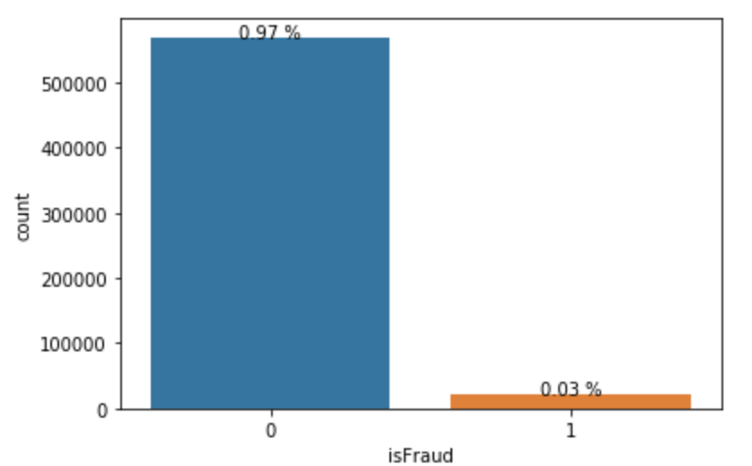

# CreditCardFraud
 This project is for the kaggle competition related to Credit Card Fraud. More details of the competition can be found [here](https://www.kaggle.com/c/ieee-fraud-detection/). 

### Exploratory Data Analysis

0.03% of the cases are fraud - a very skewed dataset. Techniques such as undersampling, oversampling or SMOTE can be used to get better results. Also, the evaluation metric should take into account the skewness of the dataset.
