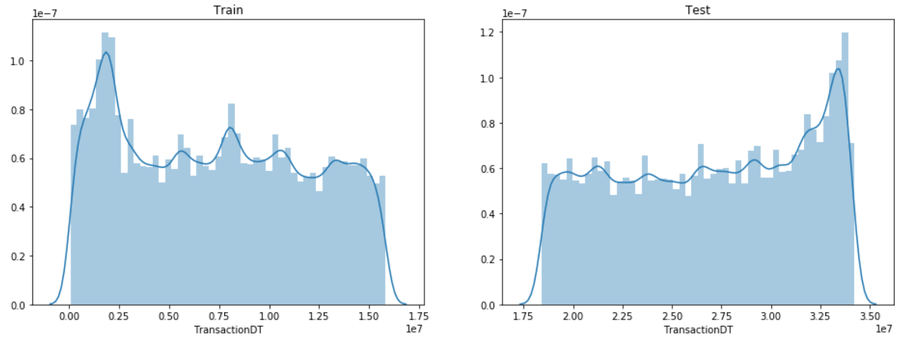
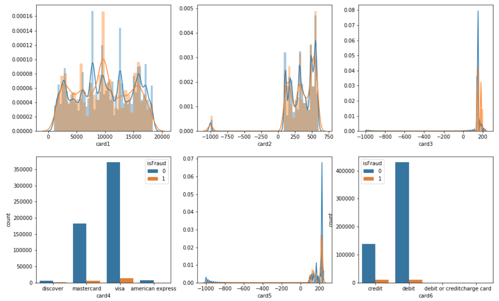
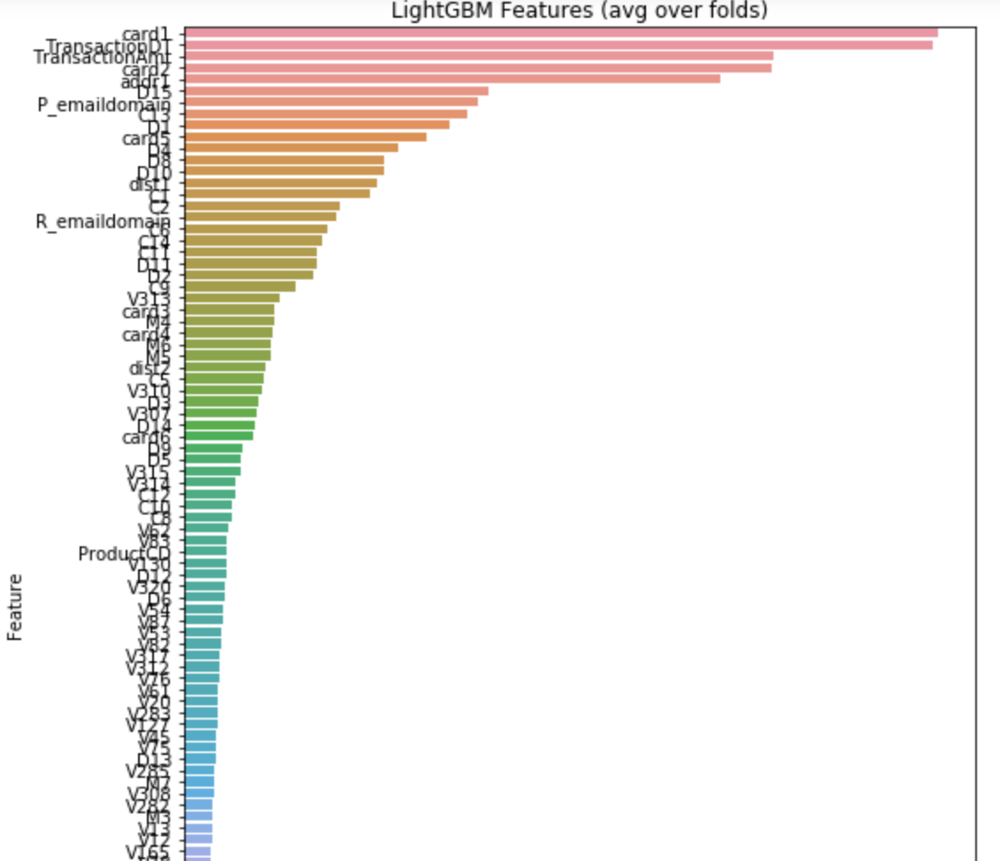

# CreditCardFraud
 This project is for the kaggle competition related to Credit Card Fraud. The aim of the project is to predict the probability that an online transaction is fraudulent. The data is provided by the world’s leading payment service company, Vesta Corporation. More details of the competition can be found [here](https://www.kaggle.com/c/ieee-fraud-detection/). 

 ### Technologies Used
 python
 pandas
 scikit-learn
 lightgbm

### Exploratory Data Analysis

0.03% of the cases are fraud - a very skewed dataset. Techniques such as undersampling, oversampling or SMOTE can be used to get better results. Also, the evaluation metric should take into account the skewness of the dataset.

Transaction Dates do not overlap between the train and test dataset. Time based split can be used in cross validation of models.

Distribution of Transaction Amounts

Card Features

### Data Preparation, Feature Selection and Feature Engineering

1) Drop Features with more than 90% values missing
2) Drop noisy features like TransactionID
3) Add card interaction features 
4) Add features for card and address interaction
5) Add mean and std of transaction amounts grouped by card and card interaction features
6) Take care of remaining missing values

Feature Importance

### Model Training
LightGBM model was used for training. More information about the LightGBM library can be found [here.](https://github.com/microsoft/LightGBM)

### Model Evaluation
The model achieved a final area under auc curve of `94.67%`.